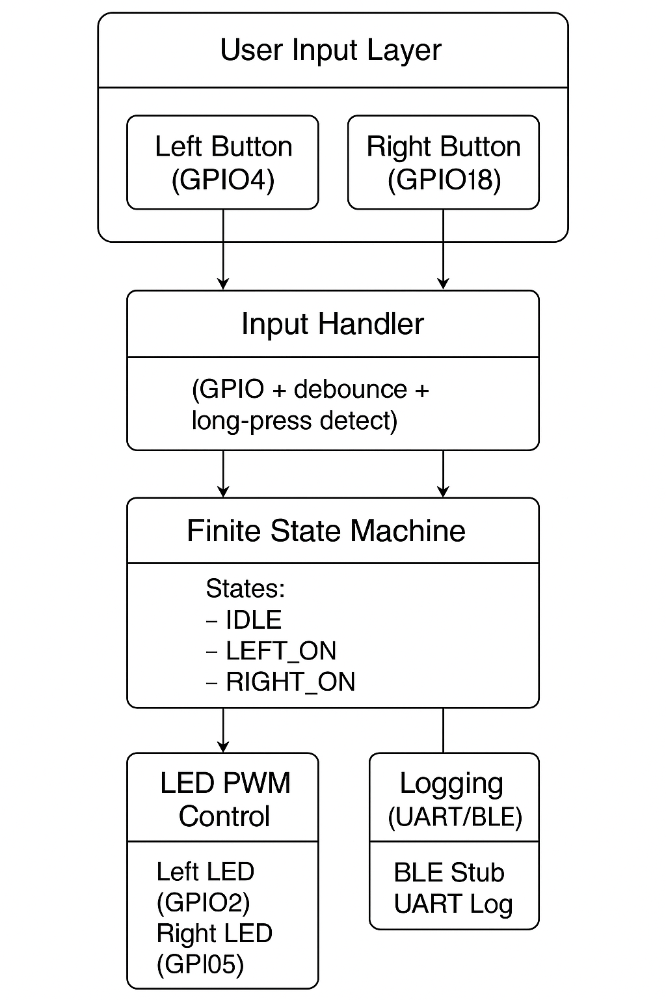
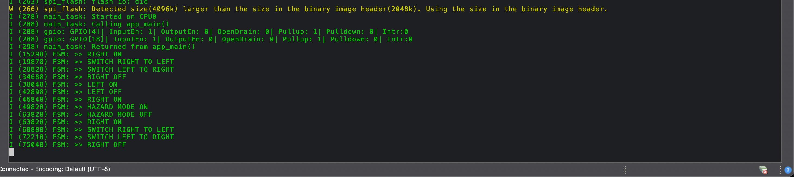

# 🚦 ESP32 Indicator Control System (FSM-Based with BLE & UART)

This project implements an **indicator control module** using an **ESP32**, featuring a **Finite State Machine (FSM)**, button-based control, **PWM blinking**, **BLE-ready architecture**, and **UART logging**.

It simulates a vehicle's **left**, **right**, and **hazard lights**, triggered by **button inputs** and programmed using the **ESP-IDF framework with FreeRTOS**.

---

## 📸 Demo Preview

> 🎥 [Google Drive: Demo Video (Zipped)](https://drive.google.com/file/d/1go1abJI06jVhiN3Q_P7xDyXh5yygv6cJ/view?usp=sharing)  
> 📄 [UART Log ](https://drive.google.com/file/d/1QvNFd2rMj3zENVTEeiAXqRNwJT9GwfgZ/view?usp=sharing)
---

## 📌 Features

- ✅ FSM-based control of indicators using GPIO buttons  
- ✅ Long-press detection (≥ 1 second)  
- ✅ Left/Right toggle logic with auto-switch  
- ✅ Hazard mode activated with both buttons together  
- ✅ LED blinking via **hardware PWM (LEDC)**  
- ✅ Logs all state transitions over **UART**  
- ✅ Runs as a FreeRTOS task scheduled every **100ms**  
- ⚙️ BLE interface *in progress / stub ready for extension*

---

## 🎯 Use Case

| Action                        | Result                                      |
|------------------------------|---------------------------------------------|
| Press **Left** button 1s     | Toggle Left LED (blinks every 300ms)        |
| Press **Right** button 1s    | Toggle Right LED (blinks every 300ms)       |
| If Right is ON, press Left   | Switch to Left (turn off Right, turn on Left) |
| Press **both buttons** 1s    | Enter Hazard mode (both LEDs blink)         |
| Press any button in hazard   | Exit Hazard mode                            |

---

## 🧱 System Architecture



## ⚙️ How to Build and Flash

### ✅ Requirements
- [ESP-IDF latest (v5.x)](https://docs.espressif.com/projects/esp-idf/en/latest/esp32/)
- ESP32 Dev Board, USB cable
- Two push buttons + two LEDs (GPIO 4, 18 for input; GPIO 2, 5 for LEDs)

### ✨ Build & Flash

```
idf.py set-target esp32
idf.py
build
idf.py -p /dev/ttyUSB0 flash monitor
````
## 🧪UART Log


---

## 🔌 GPIO Connections

| GPIO  | Function     | Notes            |
|-------|--------------|------------------|
| 4     | Left Button  | Pulled-up input  |
| 18    | Right Button | Pulled-up input  |
| 2     | Left LED     | PWM (LEDC CH0)   |
| 5     | Right LED    | PWM (LEDC CH1)   |

---

## 🚀 Future Enhancements

- 📱 BLE control via mobile app (toggle states remotely)
- 🧠 FSM logic auto-generated from Simulink Model
- ⏱ Auto-reset indicators after a timeout
- 🧪 Self-diagnostics & unit test coverage

## 📄 License

Licensed under the MIT License. See the `LICENSE` file for details.
